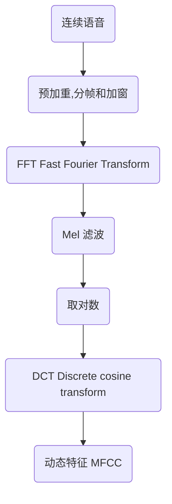

<font size=20 color=CadetBlue face="微软雅黑"><center>MFCC</center></font>

# 1. Table of Content
- [1. Table of Content](#1-table-of-content)
- [2. 梅尔倒谱系数（Mel-scaleFrequency Cepstral Coefficients）](#2-梅尔倒谱系数mel-scalefrequency-cepstral-coefficients)
  - [2.1. 梅尔标度频率](#21-梅尔标度频率)
  - [2.2. MFCC提取过程](#22-mfcc提取过程)
  - [2.3. 预加重](#23-预加重)
  - [2.4. 分帧](#24-分帧)
  - [2.5. 加窗](#25-加窗)
  - [2.6. Mel 滤波](#26-mel-滤波)
  - [2.7. 取对数](#27-取对数)
  - [2.8. DCT](#28-dct)

# 2. 梅尔倒谱系数（Mel-scaleFrequency Cepstral Coefficients）

根据人耳听觉机理的研究发现，人耳对不同频率的声波有不同的听觉敏感度。从 200Hz 到 5000Hz 的语音信号对语音的清晰度影响对大。两个响度不等的声音作用于人耳时，则响度较高的频率成分的存在会影响到对响度较低的频率成分的感受，使其变得不易察觉，这种现象称为 🌈 **<font color=Darkorange>掩蔽效应</font>**。

由于频率较低的声音在内耳蜗基底膜上行波传递的距离（速度）大于频率较高的声音，故一般来说，低音容易掩蔽高音，而高音掩蔽低音较困难。 在低频处的声音掩蔽的临界带宽较高频要小。所以，**<font color=Darkorange>人们从低频到高频这一段频带内按临界带宽的大小由密到疏安排一组带通滤波器，对输入信号进行滤波</font>**。

## 2.1. 梅尔标度频率

在梅尔标度下，如果两段语音的梅尔频率相差两倍，则人耳可以感知到的音调大概也相差两倍。
$$
mel(f)=2595 * log_{10}(1 + f/700)
$$

- 从Hz到mel的映射图，由于它们是log的关系，当频率较小时，mel随Hz变化较快；
- 当频率很大时，mel的上升很缓慢，曲线的斜率很小。这说明了人耳对低频音调的感知较灵敏，在高频时人耳是很迟钝的，梅尔标度滤波器组启发于此；

```py
import numpy as np
import matplotlib.pyplot as plt

x = np.arange(8001)
y = 2595 * np.log10(1 + x / 700)

plt.plot(x, y, color='blue', linewidth=3)

plt.xlabel("f", fontsize=17)
plt.ylabel("Mel(f)", fontsize=17)
plt.xlim(0,x[-1])
plt.ylim(0,y[-1])

plt.savefig('mel_f.png', dpi=500)
```

## 2.2. MFCC提取过程



## 2.3. 预加重

## 2.4. 分帧

## 2.5. 加窗

## 2.6. Mel 滤波

## 2.7. 取对数

## 2.8. DCT